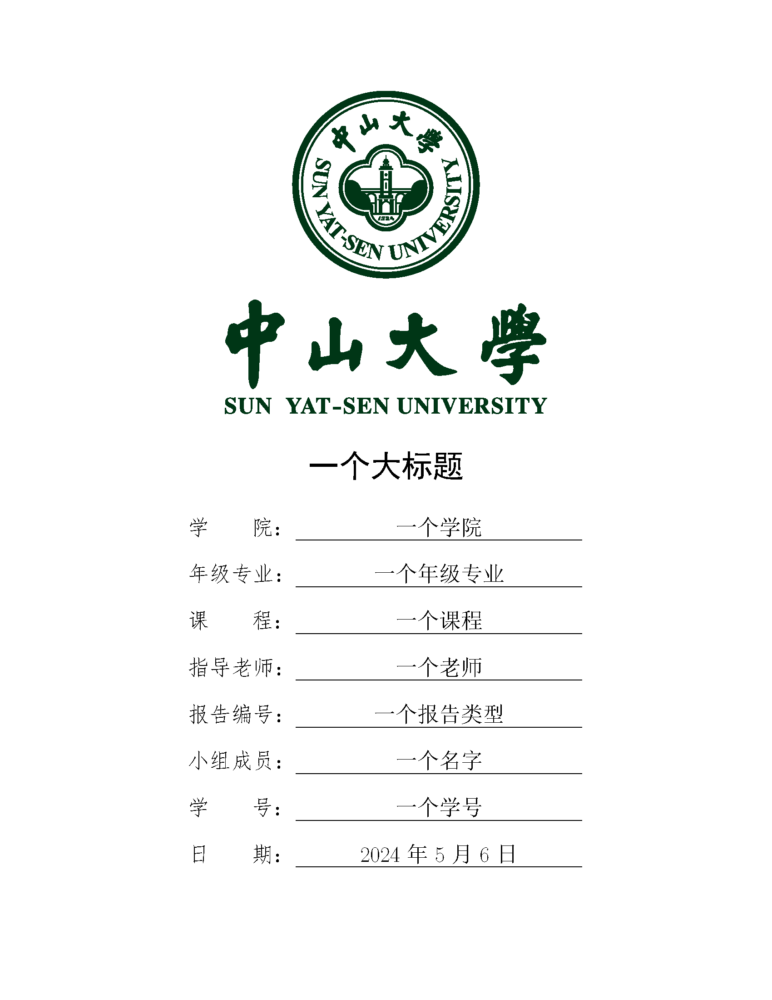
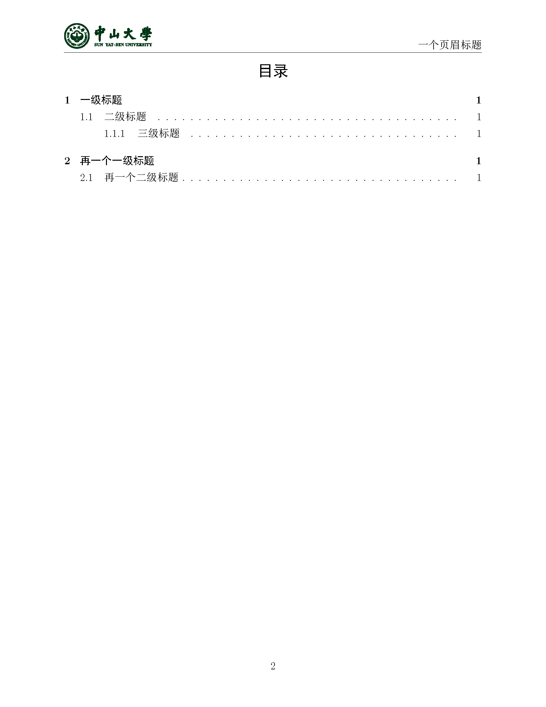
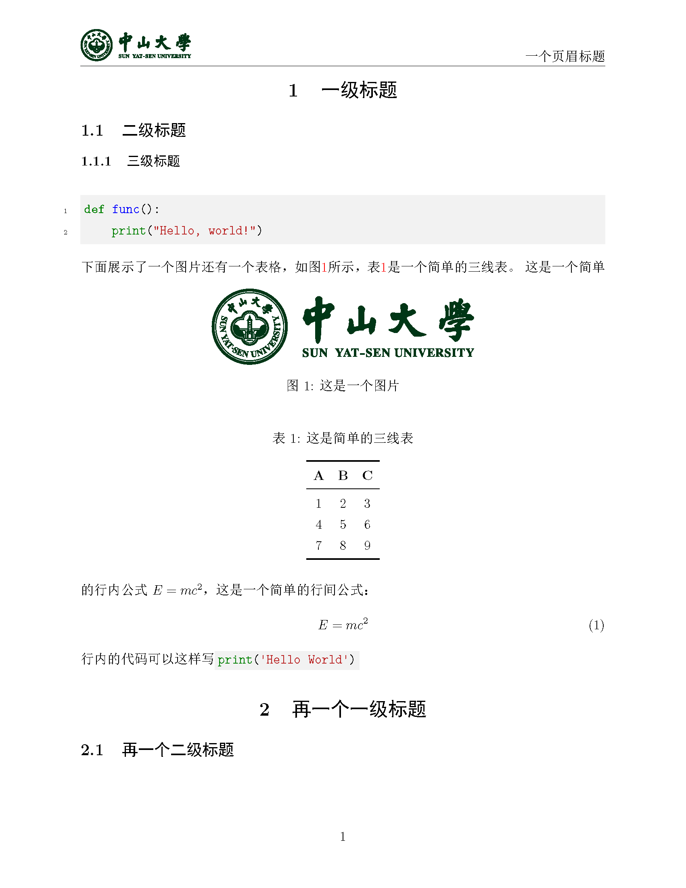

# SYSU-Report-LaTeX

 

适用于中山大学的一个简单的，自己正在使用的**LaTeX**报告模板。当然这**不能**适用于学位论文等正式论文的编写，但是对于小型的报告还是非常适用的。配合[md2tex](https://github.com/lankoestee/md2tex)适用以获得舒适的排版体验。

本文相同的模板还有几乎一模一样的**Typst**的版本！详见[SYSU-Report-Typst](https://github.com/lankoestee/sysu-report-typst)。

## 快速使用

```bash
git clone https://github.com/lankoestee/sysu-report-latex
```

克隆后，直接编辑里面的`main.tex`即可。其中有十分明显的注释标注了你应该针对自己的个人信息进行修改的地方，修改完成后就可以正常写作了。

当然对于不是中山大学的使用者而言，你可以修改`figure/badge.pdf`为自己学校或单位的正方形图标，修改`figure/badge-horizonal.pdf`为自己学校或单位的长方形图标。

> [!IMPORTANT]  
> 本模板的使用需要`minted`扩展包，这需要安装Python以及`pygments`

> [!TIP]
> 本仓库中的`image`文件夹**不是**必要的，仅为了展示README中的图片，克隆后推荐删除。

## 模板特点

- 做了一个应该还算比较好看的目录；
- 调整了页面大小至Word的标准页面大小；
- 添加了一个自动目录；
- 使用快捷命令的方法快速修改信息；
- 添加了一个简单的页眉；
- 添加了中文的参考文献标注。

## 模板展示




